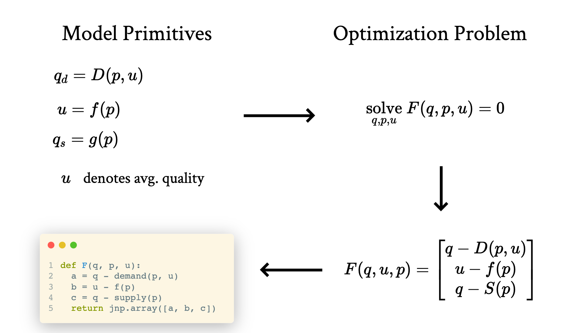

+++
title = "Teaching"
descripttion = "WIP"
+++

I teach an intermediate-level microeconomics course at Boston University. The class website can be found [here](https://pharringtonp19.github.io/mecon/).
While we follow [Hal Varian's Intermediate Mircoeconomics with Calculus: A Modern Approach](https://wwnorton.com/books/9780393689983), we depart from it in two important ways. 

### Probability Theory 

Intermediate Economics is concerned with modeling decisions that determine economic outcomes (how much to work, what to produce, how much insurance to purchase). In many contexts, decisions are made with some level of uncertainty. In this course, when modeling uncertainty, we emphasize the foundations of probability theory. That is, we think of random variables as functions, and often write down the corresponding probability space.

$$\big( \Omega, \mathcal{F}, \mathbb{P} \big) \quad X: \Omega \to \mathcal{R}$$

### Math on the Computer

In most Intermediate Microeconomic courses, a significant amount of time is spent explaining how to solve optimization problems. In this class, we focus on how to build economic models, not how to solve them. For example, we discuss and work through how to model consumer heterogeneity (by allowing the parameters of the utility and constraint functions to differ across individuals). We don't worry about how to solve these models. This allows us to focus more on the economics of the model and less on the engineering. We are able to do so by writing our models in python and calling solvers on these models. An example slide that highlights this process is shown below.

